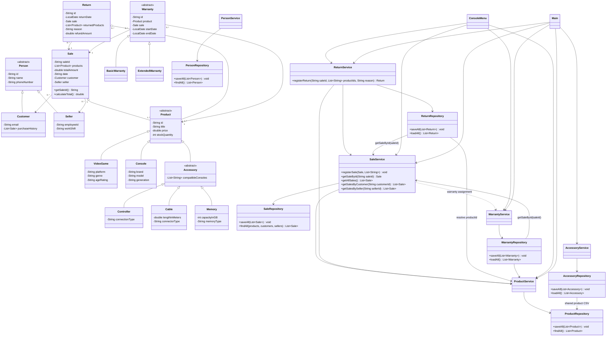

# Class Diagram

`SaleRepository` keeps the original five-field sales rows readable and writes `totalAmount` as an optional sixth field. On load it resolves product, customer, and seller IDs to the domain objects already loaded by their services. Accessories share `product.csv` with the other product types.
