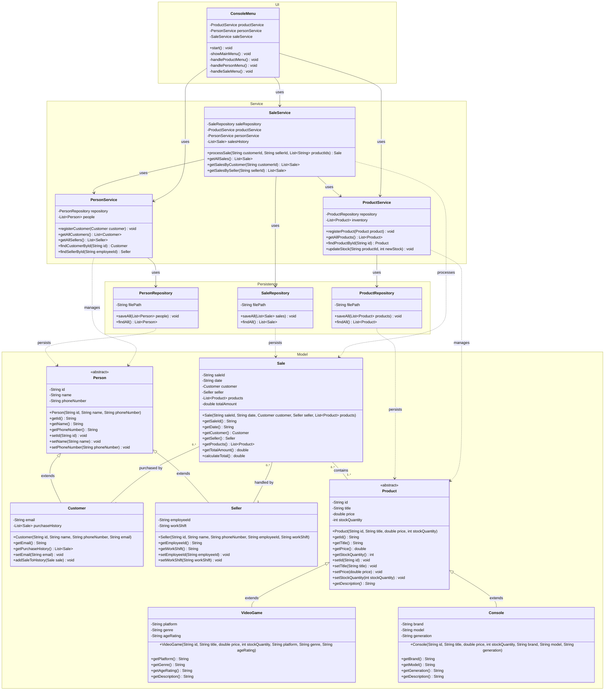

# Class Diagram

```mermaid
classDiagram

    %% ----------------------------------------------------
    %% MODEL LAYER (com.gamezone.model)
    %% ----------------------------------------------------
    namespace Model {
        class Person {
            <<abstract>>
            -String id
            -String name
            -String phoneNumber
            +Person(String id, String name, String phoneNumber)
            +getId() String
            +getName() String
            +getPhoneNumber() String
            +setId(String id) void
            +setName(String name) void
            +setPhoneNumber(String phoneNumber) void
        }

        class Customer {
            -String email
            -List~Sale~ purchaseHistory
            +Customer(String id, String name, String phoneNumber, String email)
            +getEmail() String
            +getPurchaseHistory() List~Sale~
            +setEmail(String email) void
            +addSaleToHistory(Sale sale) void
        }

        class Seller {
            -String employeeId
            -String workShift
            +Seller(String id, String name, String phoneNumber, String employeeId, String workShift)
            +getEmployeeId() String
            +getWorkShift() String
            +setEmployeeId(String employeeId) void
            +setWorkShift(String workShift) void
        }

        class Product {
            <<abstract>>
            -String id
            -String title
            -double price
            -int stockQuantity
            +Product(String id, String title, double price, int stockQuantity)
            +getId() String
            +getTitle() String
            +getPrice() double
            +getStockQuantity() int
            +setId(String id) void
            +setTitle(String title) void
            +setPrice(double price) void
            +setStockQuantity(int stockQuantity) void
            +getDescription()* String
        }

        class VideoGame {
            -String platform
            -String genre
            -String ageRating
            +VideoGame(String id, String title, double price, int stockQuantity, String platform, String genre, String ageRating)
            +getPlatform() String
            +getGenre() String
            +getAgeRating() String
            +getDescription() String
        }

        class Console {
            -String brand
            -String model
            -String generation
            +Console(String id, String title, double price, int stockQuantity, String brand, String model, String generation)
            +getBrand() String
            +getModel() String
            +getGeneration() String
            +getDescription() String
        }

        class Sale {
            -String saleId
            -String date
            -Customer customer
            -Seller seller
            -List~Product~ products
            -double totalAmount
            +Sale(String saleId, String date, Customer customer, Seller seller, List~Product~ products)
            +getSaleId() String
            +getDate() String
            +getCustomer() Customer
            +getSeller() Seller
            +getProducts() List~Product~
            +getTotalAmount() double
            +calculateTotal() double
        }
    }

    %% Inheritance Relationships
    Person <|-- Customer : extends
    Person <|-- Seller : extends
    Product <|-- VideoGame : extends
    Product <|-- Console : extends

    %% Sale Associations
    Sale "0..*" -- "1" Customer : purchased by
    Sale "0..*" -- "1" Seller : handled by
    Sale "0..*" -- "1..*" Product : contains

    %% ----------------------------------------------------
    %% PERSISTENCE LAYER (com.gamezone.persistence)
    %% ----------------------------------------------------
    namespace Persistence {
        class ProductRepository {
            -String filePath
            +saveAll(List~Product~ products) void
            +findAll() List~Product~
        }

        class PersonRepository {
            -String filePath
            +saveAll(List~Person~ people) void
            +findAll() List~Person~
        }

        class SaleRepository {
            -String filePath
            +saveAll(List~Sale~ sales) void
            +findAll() List~Sale~
        }
    }

    %% Persistence Dependencies on Model
    ProductRepository ..> Product : persists
    PersonRepository ..> Person : persists
    SaleRepository ..> Sale : persists

    %% ----------------------------------------------------
    %% SERVICE LAYER (com.gamezone.service)
    %% ----------------------------------------------------
    namespace Service {
        class ProductService {
            -ProductRepository repository
            -List~Product~ inventory
            +registerProduct(Product product) void
            +getAllProducts() List~Product~
            +findProductById(String id) Product
            +updateStock(String productId, int newStock) void
        }

        class PersonService {
            -PersonRepository repository
            -List~Person~ people
            +registerCustomer(Customer customer) void
            +getAllCustomers() List~Customer~
            +getAllSellers() List~Seller~
            +findCustomerById(String id) Customer
            +findSellerById(String employeeId) Seller
        }

        class SaleService {
            -SaleRepository saleRepository
            -ProductService productService
            -PersonService personService
            -List~Sale~ salesHistory
            +processSale(String customerId, String sellerId, List~String~ productIds) Sale
            +getAllSales() List~Sale~
            +getSalesByCustomer(String customerId) List~Sale~
            +getSalesBySeller(String sellerId) List~Sale~
        }
    }

    %% Service Layer Dependencies
    ProductService --> ProductRepository : uses
    PersonService --> PersonRepository : uses
    SaleService --> SaleRepository : uses
    SaleService --> ProductService : uses
    SaleService --> PersonService : uses
    ProductService ..> Product : manages
    PersonService ..> Person : manages
    SaleService ..> Sale : processes

    %% ----------------------------------------------------
    %% USER INTERFACE LAYER (com.gamezone.ui)
    %% ----------------------------------------------------
    namespace UI {
        class ConsoleMenu {
            -ProductService productService
            -PersonService personService
            -SaleService saleService
            +start() void
            -showMainMenu() void
            -handleProductMenu() void
            -handlePersonMenu() void
            -handleSaleMenu() void
        }
    }

    %% UI Layer Dependencies
    ConsoleMenu --> ProductService : uses
    ConsoleMenu --> PersonService : uses
    ConsoleMenu --> SaleService : uses
```