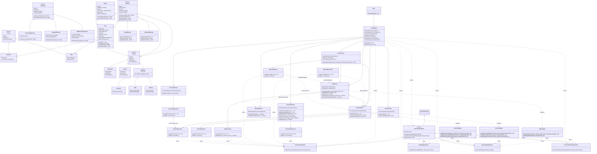

# Class Diagram

```mermaid
classDiagram
    direction TB


%% ========================================================
%% CAPA DE DOMINIO: MODELO (com.gamezone.model)
%% ========================================================
class Person {
<<abstract>>
-String id
-String name
-String phoneNumber
}
class Customer {
-String email
-List~Sale~ purchaseHistory
}
class Seller {
-String employeeId
-String workShift
}
Person <|-- Customer
Person <|-- Seller

class Product {
<<abstract>>
-String id
-String title
-double price
-int stockQuantity
    }
class VideoGame {
-String platform
-String genre
-String ageRating
}
class Console {
-String brand
-String model
-String generation
}
class Accessory {
<<abstract>>
-List~String~ compatibleConsoles
}
class Controller {
-String connectionType
}
class Cable {
-double lengthInMeters
-String connectorType
}
class Memory {
-int capacityInGB
-String memoryType
}
Product <|-- VideoGame
Product <|-- Console
Product <|-- Accessory
Accessory <|-- Controller
Accessory <|-- Cable
Accessory <|-- Memory

class Promotion {
<<abstract>>
-String id
-String name
-LocalDate startDate
-LocalDate endDate
+isActive(LocalDate date) boolean
+calculateDiscount(Sale sale)* double
}
class PercentageDiscount {
-double percentage
+calculateDiscount(Sale sale) double
}
class CategoryDiscount {
-double discountPercentage
-String categoryObjective
+calculateDiscount(Sale sale) double
}
class BulkPurchaseDiscount {
-int minimumQuantity
-double discountPercentage
-Class targetType
+calculateDiscount(Sale sale) double
    }
Promotion <|-- PercentageDiscount
Promotion <|-- CategoryDiscount
Promotion <|-- BulkPurchaseDiscount

class Sale {
-String saleId
-List~Product~ products
-double totalAmount
-String date
-Customer customer
-Seller seller
-String appliedPromotionName
-double discountAmount
+getSaleId() String
+calculateTotal() double
+canBeReturned() boolean
+generateReceipt() String
}

class Return {
-String id
-LocalDate returnDate
-Sale sale
-List~Product~ returnedProducts
-String reason
-double refundAmount
+calculateRefundAmount() double
+generateReturnReceipt() String
}

class Warranty {
<<abstract>>
-String id
-Product product
-Sale sale
-LocalDate startDate
-LocalDate endDate
+isActive(LocalDate date) boolean
+getDurationInMonths()* int
+getWarrantyType()* String
+getAdditionalCost()* double
}
class BasicWarranty {
+getDurationInMonths() int
+getWarrantyType() String
+getAdditionalCost() double
}
class ExtendedWarranty {
+getDurationInMonths() int
+getWarrantyType() String
+getAdditionalCost() double
}
Warranty <|-- BasicWarranty
Warranty <|-- ExtendedWarranty

Sale "0..*" --> "1" Customer
Sale "0..*" --> "1" Seller
Sale "1" -- "1..*" Product
Return "0..*" --> "1" Sale
Return "0..*" -- "1..*" Product
Warranty "0..*" --> "1" Product
Warranty "0..*" --> "1" Sale

%% ========================================================
%% CAPA DE ACCESO A DATOS (com.gamezone.persistence)
%% ========================================================
class ProductRepository {
+saveAll(List~Product~ list) void
+findAll() List~Product~
    }
class AccessoryRepository {
+saveAll(List~Accessory~ list) void
+loadAll() List~Accessory~
    }
class PersonRepository {
+saveAll(List~Person~ list) void
+findAll() List~Person~
    }
class SaleRepository {
+saveAll(List~Sale~ list) void
+findAll(products, customers, sellers) List~Sale~
}
class ReturnRepository {
+saveAll(List~Return~ list) void
+loadAll() List~Return~
    }
class WarrantyRepository {
+saveAll(List~Warranty~ list) void
+loadAll() List~Warranty~
    }
class PromotionRepository {
+saveAll(List~Promotion~ list) void
+loadAll() List~Promotion~
    }

AccessoryRepository --> ProductRepository : shared product CSV
ReturnRepository ..> SaleService : getSaleById(saleId)
ReturnRepository ..> ProductService : resolve productId
WarrantyRepository ..> SaleService : getSaleById(saleId)
WarrantyRepository ..> ProductService : resolve productId

ProductRepository ..> PersistenceException : throws
PersonRepository ..> PersistenceException : throws
SaleRepository ..> PersistenceException : throws
ReturnRepository ..> PersistenceException : throws
WarrantyRepository ..> PersistenceException : throws
PromotionRepository ..> PersistenceException : throws

%% ========================================================
%% CAPA DE LÓGICA DE NEGOCIO (com.gamezone.service)
%% ========================================================
class ProductService {
-ProductRepository productRepository
+registerProduct(...) void
+findProductById(String id) Product
+updateStock(String id, int qty) void
}
class AccessoryService {
-AccessoryRepository accessoryRepository
+listAllAccessories() List~Accessory~
}
class PersonService {
-PersonRepository personRepository
+registerPerson(...) void
+findPersonById(String id) Person
}
class SaleService {
-SaleRepository saleRepository
-ProductService productService
+registerSale(Sale sale, List~String~ items) void
+getSaleById(String saleId) Sale
+getAllSales() List~Sale~
+getSalesByCustomer(String customerId) List~Sale~
+getSalesBySeller(String sellerId) List~Sale~
}
class ReturnService {
-ReturnRepository returnRepository
-SaleService saleService
-ProductService productService
+registerReturn(String saleId, List~String~ productIds, String reason) Return
}
class WarrantyService {
-WarrantyRepository warrantyRepository
+assignBasicWarranty(...) Warranty
+assignExtendedWarranty(...) Warranty
}
class PromotionService {
-PromotionRepository promotionRepository
+registerPercentageDiscount(...) void
+registerCategoryDiscount(...) void
+registerBulkPurchaseDiscount(...) void
+listAllPromotions() List~Promotion~
+listActivePromotions() List~Promotion~
+findBestPromotionFor(Sale sale) Promotion
+findById(String id) Promotion
}

ProductService --> ProductRepository
AccessoryService --> AccessoryRepository
PersonService --> PersonRepository
SaleService --> SaleRepository
SaleService --> ProductService
SaleService ..> WarrantyService : warranty assignment
ReturnService --> ReturnRepository
ReturnService --> SaleService
ReturnService --> ProductService
PromotionService --> PromotionRepository

ProductService ..> ProductValidator : delegates
PersonService ..> PersonValidator : delegates
SaleService ..> SaleValidator : delegates

%% ========================================================
%% CAPA DE PRESENTACIÓN & ENTRADA (com.gamezone.ui)
%% ========================================================
class ConsoleMenu {
-ProductService productService
-AccessoryService accessoryService
-PersonService personService
-SaleService saleService
-ReturnService returnService
-WarrantyService warrantyService
-PromotionService promotionService
+displayMenu() void
+handleUserAction() void
    }

class Main {
+main(String[] args)$ void
}

ConsoleMenu --> ProductService
ConsoleMenu --> AccessoryService
ConsoleMenu --> PersonService
ConsoleMenu --> SaleService
ConsoleMenu --> ReturnService
ConsoleMenu --> WarrantyService
ConsoleMenu --> PromotionService

ConsoleMenu ..> ResourceNotFoundException : catches
ConsoleMenu ..> BusinessRuleException : catches
ConsoleMenu ..> InvalidDataException : catches
ConsoleMenu ..> PersistenceException : catches
ConsoleMenu ..> GameZoneException : catches


%% ========================================================
%% CAPA TRANSVERSAL: EXCEPCIONES (com.gamezone.exceptions)
%% ========================================================
    class RuntimeException {
    }

    class GameZoneException {
        <<abstract>>
        -String errorCode
        +GameZoneException(String message)
        +GameZoneException(String message, String errorCode)
        +getErrorCode() String
    }

    class ResourceNotFoundException {
        +ResourceNotFoundException(String resourceType, String identifier)
    }

    class BusinessRuleException {
        +BusinessRuleException(String message)
    }

    class InvalidDataException {
        +InvalidDataException(fieldName: String, reason: String)
    }

    class PersistenceException {
        +PersistenceException(String message, Throwable cause)
    }

    RuntimeException <|-- GameZoneException
    GameZoneException <|-- ResourceNotFoundException
    GameZoneException <|-- BusinessRuleException
    GameZoneException <|-- InvalidDataException
    GameZoneException <|-- PersistenceException

%% ========================================================
%% CAPA TRANSVERSAL: VALIDACIONES (com.gamezone.validation)
%% ========================================================
    class ProductValidator {
        +validateProductData(String id, String title, double price, int stock)$ void
        +validateStockAvailability(Product product, int requestedQuantity)$ void
        +validateProductExists(Product product, String productId)$ void
    }

    class PersonValidator {
        +validatePersonData(String id, String name, String email, String phone)$ void
        +validatePersonExists(Person person, String personId)$ void
        +validateUniquePerson(List~Person~ existing, String newId)$ void
    }

    class SaleValidator {
        +validateSaleData(Customer customer, Seller seller, List~Product~ products)$ void
        +validateSaleExists(Sale sale, String saleId)$ void
    }

    ProductValidator ..> InvalidDataException : throws
    ProductValidator ..> BusinessRuleException : throws
    ProductValidator ..> ResourceNotFoundException : throws

    PersonValidator ..> InvalidDataException : throws
    PersonValidator ..> BusinessRuleException : throws
    PersonValidator ..> ResourceNotFoundException : throws

    SaleValidator ..> InvalidDataException : throws
    SaleValidator ..> BusinessRuleException : throws
    SaleValidator ..> ResourceNotFoundException : throws

Main --> ConsoleMenu
```
