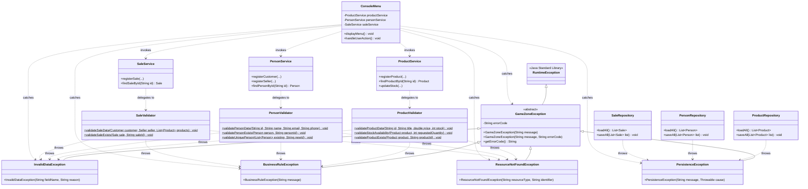

```mermaid


classDiagram
direction TB

    %% ----------------------------------------------------
    %% JAVA BASE
    %% ----------------------------------------------------
    class RuntimeException {
        <<Java Standard Library>>
    }

    %% ----------------------------------------------------
    %% EXCEPTION HIERARCHY (com.gamezone.exceptions)
    %% ----------------------------------------------------
    class GameZoneException {
        <<abstract>>
        -String errorCode
        +GameZoneException(String message)
        +GameZoneException(String message, String errorCode)
        +getErrorCode() String
    }

    class ResourceNotFoundException {
        +ResourceNotFoundException(String resourceType, String identifier)
    }

    class BusinessRuleException {
        +BusinessRuleException(String message)
    }

    class InvalidDataException {
        +InvalidDataException(String fieldName, String reason)
    }

    class PersistenceException {
        +PersistenceException(String message, Throwable cause)
    }

    RuntimeException <|-- GameZoneException
    GameZoneException <|-- ResourceNotFoundException
    GameZoneException <|-- BusinessRuleException
    GameZoneException <|-- InvalidDataException
    GameZoneException <|-- PersistenceException

    %% ----------------------------------------------------
    %% VALIDATION LAYER (com.gamezone.validation)
    %% ----------------------------------------------------
    class ProductValidator {
        +validateProductData(String id, String title, double price, int stock)$ void
        +validateStockAvailability(Product product, int requestedQuantity)$ void
        +validateProductExists(Product product, String productId)$ void
    }

    class PersonValidator {
        +validatePersonData(String id, String name, String email, String phone)$ void
        +validatePersonExists(Person person, String personId)$ void
        +validateUniquePerson(List~Person~ existing, String newId)$ void
    }

    class SaleValidator {
        +validateSaleData(Customer customer, Seller seller, List~Product~ products)$ void
        +validateSaleExists(Sale sale, String saleId)$ void
    }

    %% Validators throw specific exceptions
    ProductValidator ..> InvalidDataException : throws
    ProductValidator ..> BusinessRuleException : throws
    ProductValidator ..> ResourceNotFoundException : throws

    PersonValidator ..> InvalidDataException : throws
    PersonValidator ..> BusinessRuleException : throws
    PersonValidator ..> ResourceNotFoundException : throws

    SaleValidator ..> InvalidDataException : throws
    SaleValidator ..> BusinessRuleException : throws
    SaleValidator ..> ResourceNotFoundException : throws

    %% ----------------------------------------------------
    %% SERVICE LAYER (com.gamezone.service)
    %% ----------------------------------------------------
    class ProductService {
        +registerProduct(...)
        +findProductById(String id) Product
        +updateStock(...)
    }

    class PersonService {
        +registerCustomer(...)
        +registerSeller(...)
        +findPersonById(String id) Person
    }

    class SaleService {
        +registerSale(...)
        +findSaleById(String id) Sale
    }

    %% Services use Validators
    ProductService ..> ProductValidator : delegates to
    PersonService ..> PersonValidator : delegates to
    SaleService ..> SaleValidator : delegates to

    %% ----------------------------------------------------
    %% PERSISTENCE LAYER (com.gamezone.persistence)
    %% ----------------------------------------------------
    class ProductRepository {
        +loadAll() List~Product~
        +saveAll(List~Product~ list) void
    }

    class PersonRepository {
        +loadAll() List~Person~
        +saveAll(List~Person~ list) void
    }

    class SaleRepository {
        +loadAll() List~Sale~
        +saveAll(List~Sale~ list) void
    }

    %% Repositories throw PersistenceException
    ProductRepository ..> PersistenceException : throws
    PersonRepository ..> PersistenceException : throws
    SaleRepository ..> PersistenceException : throws

    %% ----------------------------------------------------
    %% PRESENTATION LAYER (com.gamezone.ui)
    %% ----------------------------------------------------
    class ConsoleMenu {
        -ProductService productService
        -PersonService personService
        -SaleService saleService
        +displayMenu() void
        +handleUserAction() void
    }

    ConsoleMenu ..> ProductService : invokes
    ConsoleMenu ..> PersonService : invokes
    ConsoleMenu ..> SaleService : invokes

    %% UI Catches differentiated exceptions
    ConsoleMenu ..> ResourceNotFoundException : catches
    ConsoleMenu ..> BusinessRuleException : catches
    ConsoleMenu ..> InvalidDataException : catches
    ConsoleMenu ..> PersistenceException : catches
    ConsoleMenu ..> GameZoneException : catches
    

```