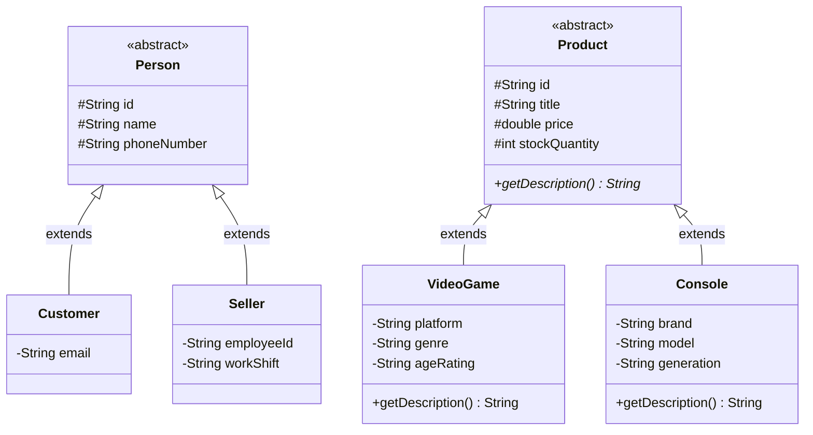

# Inheritance Hierarchy Diagram

```mermaid
classDiagram
    %% Person Hierarchy
    class Person {
        <<abstract>>
        #String id
        #String name
        #String phoneNumber
    }

    class Customer {
        -String email
    }

    class Seller {
        -String employeeId
        -String workShift
    }

    Person <|-- Customer : extends
    Person <|-- Seller : extends

    %% Product Hierarchy
    class Product {
        <<abstract>>
        #String id
        #String title
        #double price
        #int stockQuantity
        +getDescription()* String
    }

    class VideoGame {
        -String platform
        -String genre
        -String ageRating
        +getDescription() String
    }

    class Console {
        -String brand
        -String model
        -String generation
        +getDescription() String
    }

    Product <|-- VideoGame : extends
    Product <|-- Console : extends
```