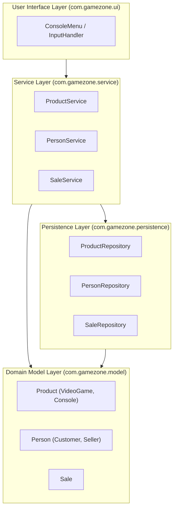

# Architecture Layers Diagram

```mermaid
flowchart TD
    %% Layer Nodes
    subgraph UI ["User Interface Layer (com.gamezone.ui)"]
        ConsoleMenu["ConsoleMenu / InputHandler"]
    end

    subgraph SERVICE ["Service Layer (com.gamezone.service)"]
        ProductService["ProductService"]
        PersonService["PersonService"]
        SaleService["SaleService"]
    end

    subgraph PERSISTENCE ["Persistence Layer (com.gamezone.persistence)"]
        ProductRepo["ProductRepository"]
        PersonRepo["PersonRepository"]
        SaleRepo["SaleRepository"]
    end

    subgraph MODEL ["Domain Model Layer (com.gamezone.model)"]
        Product["Product (VideoGame, Console)"]
        Person["Person (Customer, Seller)"]
        Sale["Sale"]
    end

    %% Allowed Dependency Flow
    UI --> SERVICE
    SERVICE --> PERSISTENCE
    SERVICE --> MODEL
    PERSISTENCE --> MODEL
    
```