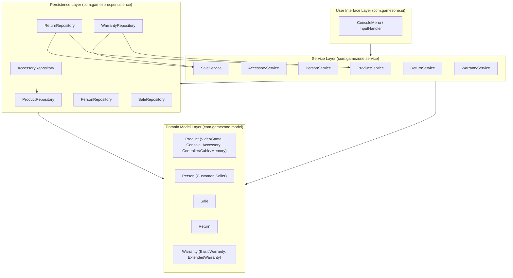

# Architecture Layers Diagram

```mermaid
flowchart TD
    %% Layer Nodes
    subgraph UI ["User Interface Layer (com.gamezone.ui)"]
        ConsoleMenu["ConsoleMenu / InputHandler"]
    end

    subgraph SERVICE ["Service Layer (com.gamezone.service)"]
        ProductService["ProductService"]
        AccessoryService["AccessoryService"]
        PersonService["PersonService"]
        SaleService["SaleService"]
        ReturnService["ReturnService"]
        WarrantyService["WarrantyService"]
    end

    subgraph PERSISTENCE ["Persistence Layer (com.gamezone.persistence)"]
        ProductRepo["ProductRepository"]
        AccessoryRepo["AccessoryRepository"]
        PersonRepo["PersonRepository"]
        SaleRepo["SaleRepository"]
        ReturnRepo["ReturnRepository"]
        WarrantyRepo["WarrantyRepository"]
    end

    subgraph MODEL ["Domain Model Layer (com.gamezone.model)"]
        Product["Product (VideoGame, Console, Accessory: Controller/Cable/Memory)"]
        Person["Person (Customer, Seller)"]
        Sale["Sale"]
        Return["Return"]
        Warranty["Warranty (BasicWarranty, ExtendedWarranty)"]
    end

    %% Allowed Dependency Flow
    UI --> SERVICE
    SERVICE --> PERSISTENCE
    SERVICE --> MODEL
    PERSISTENCE --> MODEL
    AccessoryRepo --> ProductRepo
    ReturnRepo --> SaleService
    ReturnRepo --> ProductService
    WarrantyRepo --> SaleService
    WarrantyRepo --> ProductService
    
```
