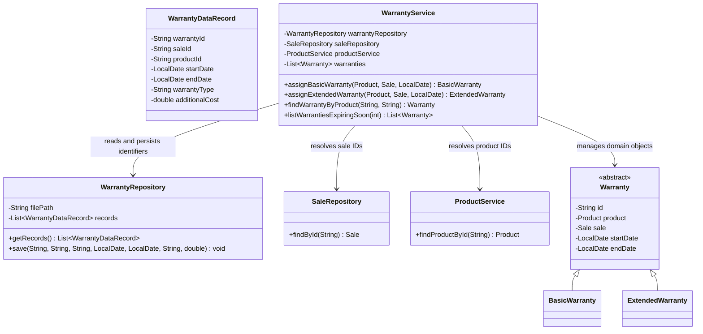

# Warranty Module Class Diagram

```mermaid
classDiagram
    class WarrantyRepository {
        -String filePath
        -List~WarrantyDataRecord~ records
        +getRecords() List~WarrantyDataRecord~
        +save(String, String, String, LocalDate, LocalDate, String, double) void
    }
    class WarrantyDataRecord {
        -String warrantyId
        -String saleId
        -String productId
        -LocalDate startDate
        -LocalDate endDate
        -String warrantyType
        -double additionalCost
    }
    class WarrantyService {
        -WarrantyRepository warrantyRepository
        -SaleRepository saleRepository
        -ProductService productService
        -List~Warranty~ warranties
        +assignBasicWarranty(Product, Sale, LocalDate) BasicWarranty
        +assignExtendedWarranty(Product, Sale, LocalDate) ExtendedWarranty
        +findWarrantyByProduct(String, String) Warranty
        +listWarrantiesExpiringSoon(int) List~Warranty~
    }
    class SaleRepository {
        +findById(String) Sale
    }
    class ProductService {
        +findProductById(String) Product
    }
    class Warranty {
        <<abstract>>
        -String id
        -Product product
        -Sale sale
        -LocalDate startDate
        -LocalDate endDate
    }
    class BasicWarranty
    class ExtendedWarranty

    WarrantyService --> WarrantyRepository : reads and persists identifiers
    WarrantyService --> SaleRepository : resolves sale IDs
    WarrantyService --> ProductService : resolves product IDs
    WarrantyService --> Warranty : manages domain objects
    Warranty <|-- BasicWarranty
    Warranty <|-- ExtendedWarranty
```
